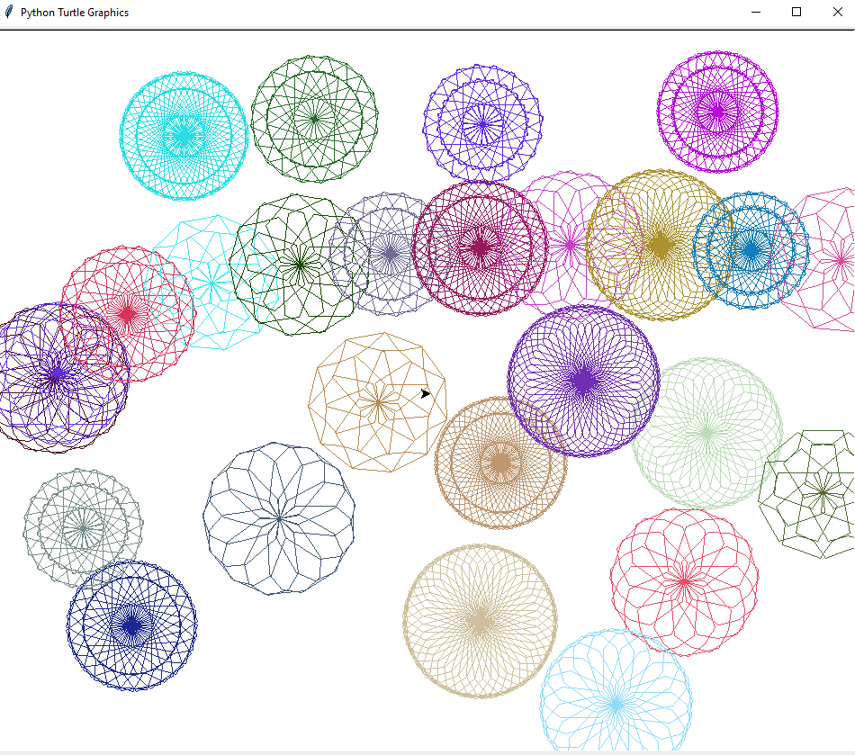

# Beautiful-Madala

Cette application Python utilise l'interface Turtle pour créer des mandalas colorés. Elle permet de dessiner en cliquant avec le bouton droit de la souris et de réinitialiser le dessin en cliquant avec le bouton gauche.

## Fonctionnalités

- **Dessin de mandalas**: Cliquez avec le bouton droit de la souris pour dessiner des cercles de différentes couleurs et former des mandalas.
- **Réinitialisation**: Cliquez avec le bouton gauche de la souris pour réinitialiser le dessin et recommencer à zéro.

## Installation

1. Assurez-vous d'avoir Python installé sur votre système.
2. Téléchargez ou clonez ce dépôt sur votre machine.
3. Exécutez le fichier `mandala.py` avec Python.

Utilisation
Exécutez le fichier mandala.py.
Cliquez avec le bouton droit de la souris pour dessiner des cercles de différentes couleurs.
Cliquez avec le bouton gauche de la souris pour réinitialiser le dessin.

